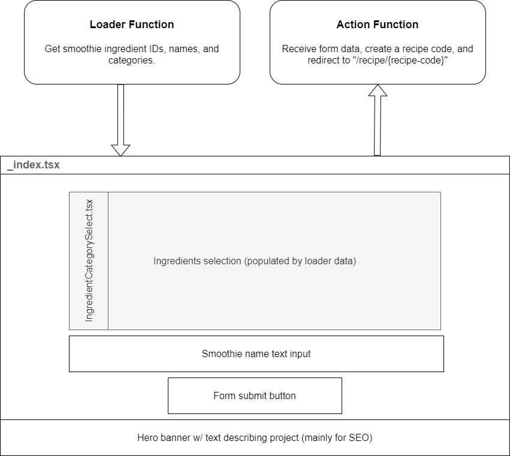

# PROJECT NOT COMPLETE YET, IGNORE THIS README FOR NOW

# Build Your Own Smoothie

_Build Your Own Smoothie_ is a tool built for wellness influencer [Alessandra Cardin](https://www.instagram.com/alessandracardinn/). It allows users to select their favorite smoothie ingredients, and returns a recipe page that includes information on the health benefits of their smoothie.

[buildyourownsmoothie.com](https://www.wikipedia.org)

This repository contains a version of the project that was built using Remix, Prisma, Cloudflare D1, and DaisyUI. In order to host _Build Your Own Smoothie_ to be hosted for free on Cloudflare Pages, this project was recreated using only JavaScript, 11ty, JSON, and DaisyUI. That repository can be viewed [here](https://www.wikipedia.org).

## Contents

1. [Component Wireframes](#1-component-wireframes)
2. [Database Design](#2-database-design)
3. [Prisma Schema](#3-prisma-schema)
4. [Hosting on Cloudflare Pages]()

## 1. Component Wireframes

### root.tsx


### \_index.tsx



### recipe.tsx


## 2. Database Design


## 3. Prisma schema

```prisma
// prisma.schema
generator client {
provider = "prisma-client-js"
}

datasource db {
provider = "postgresql" // or another provider like MySQL
url = env("DATABASE_URL")
}

model Blender {
BlenderID Int @id @default(autoincrement())
BlenderName String
Link String
Benefits String
CreatedAt DateTime @default(now())
}

model Recipe {
RecipeID Int @id @default(autoincrement())
RecipeName String
Instructions String
CreatedAt DateTime @default(now())
RecipeIngredients RecipeIngredient[]
}

model Ingredient {
IngredientID Int @id @default(autoincrement())
IngredientName String
Category Category
Quantity Float
VitaminA Float
VitaminC Float
Calcium Float
Iron Float
Potassium Float
Benefits String
RecipeIngredients RecipeIngredient[]
}

model RecipeIngredient {
RecipeID Int
IngredientID Int
Quantity String

Recipe Recipe @relation(fields: [RecipeID], references: [RecipeID])
Ingredient Ingredient @relation(fields: [IngredientID], references: [IngredientID])

@@id([RecipeID, IngredientID])
}

enum Category {
LIQ
FRU
VEG
GRA
NUT
SUP
}
```

## 4. Hosting on Cloudflare Pages

### Remix Version

<div style="text-align: center;">


</div>

Remix uses server-side rendering to build webpages before serving them to the client. This can be very useful in many circumstances, but is not necessary for a simple tool like _Build Your Own Smoothie_. Remix requires an origin server that can fulfill dynamic requests—which can be expensive. Static requests on Cloudflare Pages, on the other hand, are free.

### JavaScript Version

<div style="text-align: center;">


</div>

In the JavaScript version of this project, all application logic is performed by the user's browser. This means the app is only required to fulfill static requests, and can be hosted for free on Cloudflare Pages.
