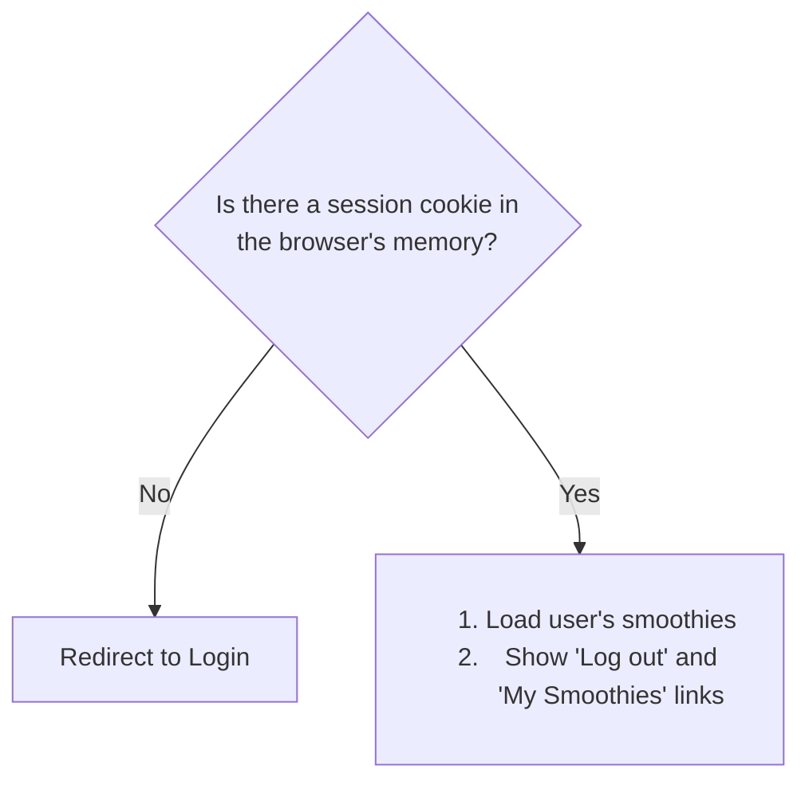
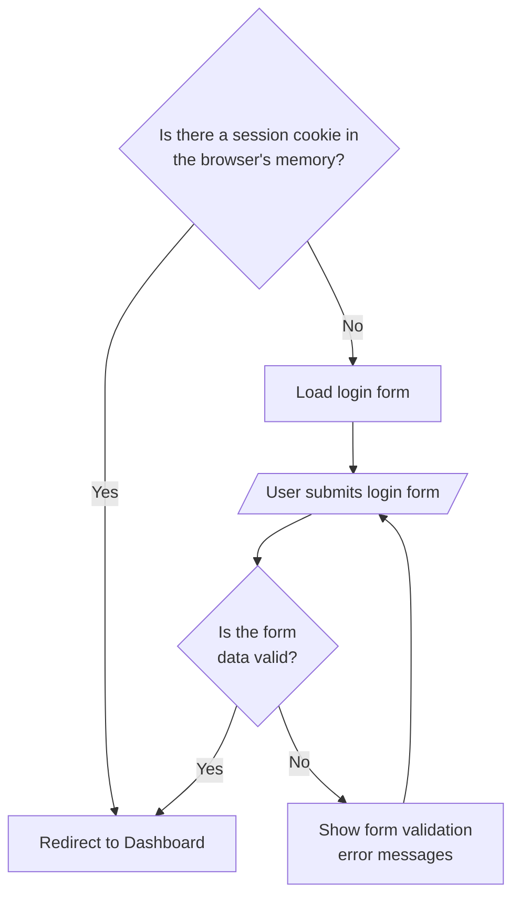
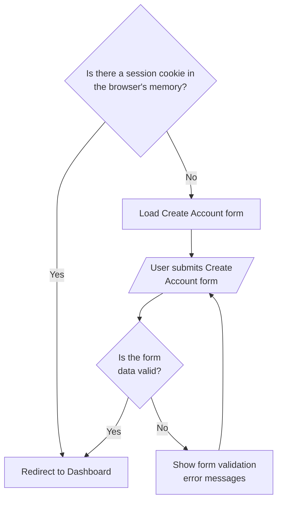
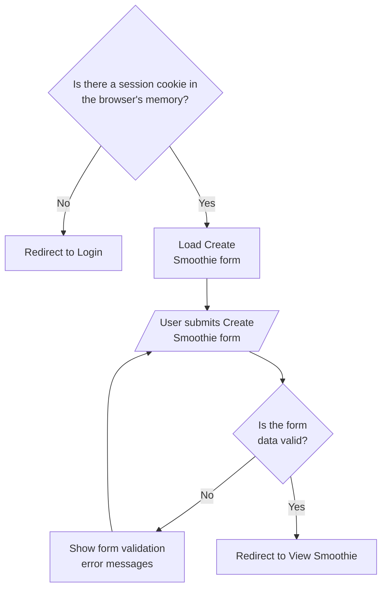
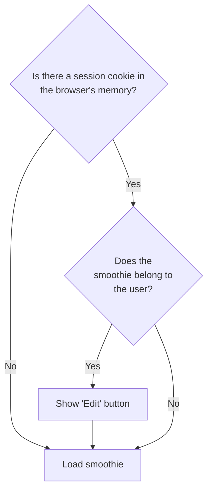
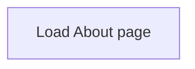
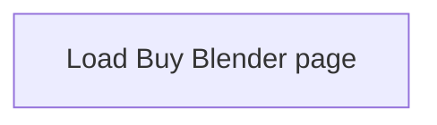

# Build Your Own Smoothie App (Remix Version w/ Accounts)

_Build Your Own Smoothie_ will have 7 pages:

1. [Dashboard (Homepage)](#1-dashboard-homepage)
2. [Login](#2-login)
3. [Create Account](#3-create-account)
4. [Create Smoothie](#4-create-smoothie)
5. [View Smoothie](#5-view-smoothie)
6. [About](#6-about)
7. [Buy Blender](#7-buy-blender)

## 1. Dashboard (Homepage) - /index

## 2. Login - /login

## 3. Create Account - /create-account

## 4. Create Smoothie - /create

## 5. View Smoothie - /smoothies/$recipeId

## 6. About - /about

## 7. Buy Blender - /blenders

