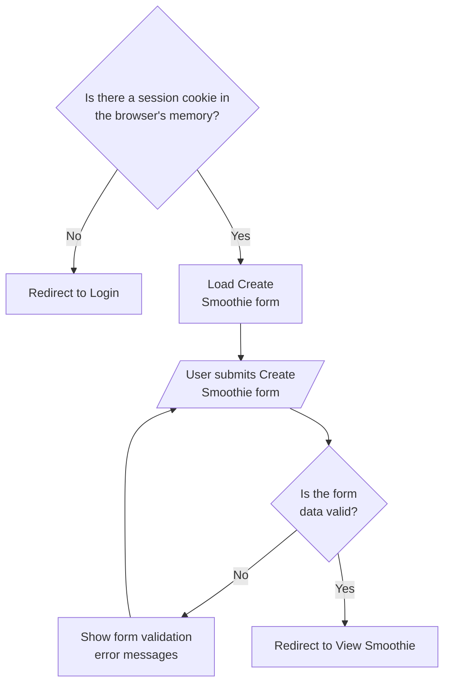
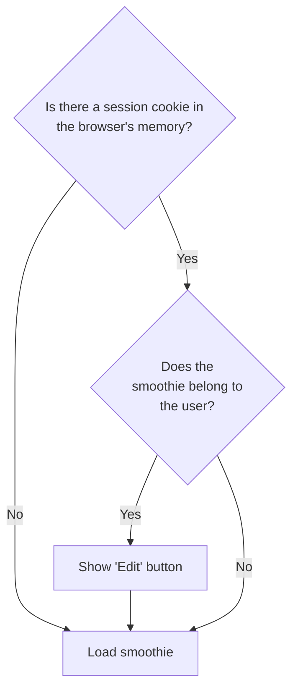
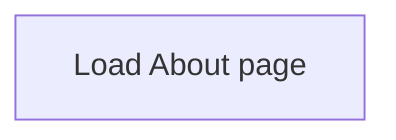
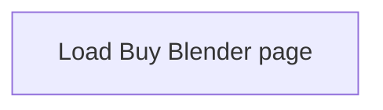

# Build Your Own Smoothie App (Remix Version w/ Accounts)

_Build Your Own Smoothie_ will have 7 pages:

1. [Create Smoothie (Homepage)](#1-create-smoothie)
2. [View Smoothie](#2-view-smoothie)
3. [About](#3-about)
4. [Buy Blender](#4-buy-blender)

## 1. Create Smoothie (Homepage)

## 2. View Smoothie

## 3. About

## 4. Buy Blender

